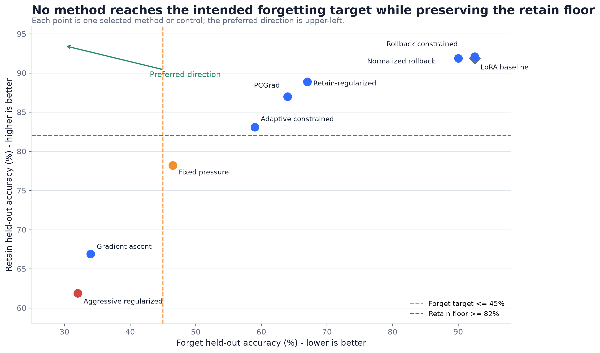
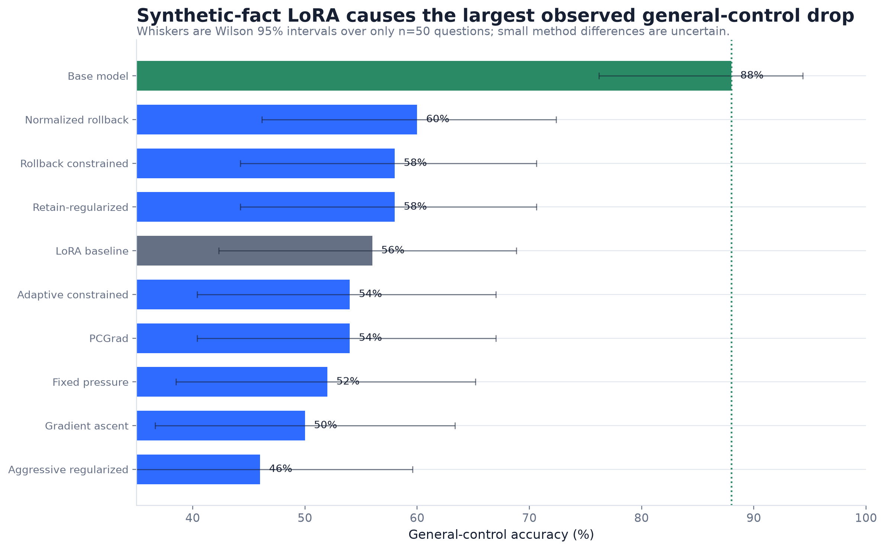

# Machine Unlearning in a Small Language Model

**Progress report: selective forgetting versus retained utility**

**Author:** Hannan Seyfi
**Generated:** 2026-07-20

## Executive summary

- The evaluated methods trace a clear frontier: stronger forgetting is consistently associated with lower retained-fact accuracy.
- No selected method simultaneously reaches the 45% forget held-out target and the 82% retain held-out floor.
- General-control accuracy falls from 88% in the base model to 56% after LoRA; with only 50 control questions, later 2-4 point differences are one or two answers.
- Rollback variants preserve utility but produce little measurable forgetting, making them useful negative results rather than successful unlearning methods.

## Experimental setup

- Model: Qwen2.5-0.5B-Instruct with LoRA adapters.
- Synthetic dataset: 100 personas, 5 fact categories per persona, 20 forget personas, and 80 retain personas.
- Evaluation: 1500 synthetic questions (500 training-identical and 1000 held-out paraphrases).
- Held-out sample sizes: forget n=200, retain n=800; general controls n=50.
- Lower forget accuracy is better. Higher retain and general-control accuracy are better.

## Final results

| Method                 |   Forget held-out |   Retain held-out |   General control | Interpretation                                                                     |
|:-----------------------|------------------:|------------------:|------------------:|:-----------------------------------------------------------------------------------|
| LoRA baseline          |              92.5 |              91.9 |              56.0 | Learned starting point before unlearning                                           |
| Gradient ascent        |              34.0 |              66.9 |              50.0 | Strong forgetting with substantial collateral retain damage                        |
| Retain-regularized     |              67.0 |              88.9 |              58.0 | Preservation-oriented checkpoint with incomplete forgetting                        |
| Aggressive regularized |              32.0 |              61.9 |              46.0 | Strongest forgetting but worst combined utility outcome                            |
| PCGrad                 |              64.0 |              87.0 |              54.0 | Small forgetting improvement over Week 5 preserving while retaining utility floors |
| Adaptive constrained   |              59.0 |              83.1 |              54.0 | Best selected balance under the global utility floors                              |
| Fixed pressure         |              46.5 |              78.2 |              52.0 | Nearer the forget target but below the retain floor                                |
| Rollback constrained   |              92.5 |              92.1 |              58.0 | Preserved utility but produced no measurable held-out forgetting                   |
| Normalized rollback    |              90.0 |              91.9 |              60.0 | Preservation-first negative result with only a 2.5-point forget reduction          |

## Interpretation

The results support a trade-off conclusion, not a universal winner. Gradient ascent and the aggressive regularized checkpoint produce the strongest forgetting but substantial collateral damage. Retain-regularized and PCGrad preserve more utility but forget less. Adaptive and fixed-pressure variants occupy intermediate positions. Rollback variants preserve the learned adapter but make little progress on forgetting.

The statement that Adaptive is "best" should therefore be conditional. Under a retain held-out floor of 82%, Adaptive is the strongest selected method that remains above the floor in the full evaluation, but it still misses the 45% forget target.

## Evidence still needed

1. **Oracle retain-only retraining:** restart from the base model and train only on the retain subset. This is the correct behavioral reference for successful unlearning.
2. **Repeated seeds and uncertainty:** report mean, standard deviation, and paired bootstrap intervals across questions and seeds.
3. **Extraction-oriented forgetting tests:** use paraphrases, hints, repeated sampling, token log-probability, and partial-answer matching.
4. **Fine-tuning utility audit:** investigate the 88% to 56% general-control drop before attributing utility damage mainly to unlearning.
5. **Larger-model replication:** move to Qwen2.5-1.5B only after the evaluation and oracle baseline are stable.

## Questions for the professor

- Which utility constraint should define an acceptable unlearning result: retain >= 82%, retain >= 85%, or another threshold?
- Should the next compute budget prioritize the retain-only oracle and multiple seeds before scaling the model?
- Is exact/contains-value accuracy sufficient for the thesis claim, or should probability- and extraction-based metrics be required?

## Reproducibility notes

All plotted final metrics are drawn from versioned repository outputs. The tables folder contains the exact chart data, Wilson intervals, dataset audit, candidate summaries, and selected qualitative examples. The source manifest records input file hashes.
