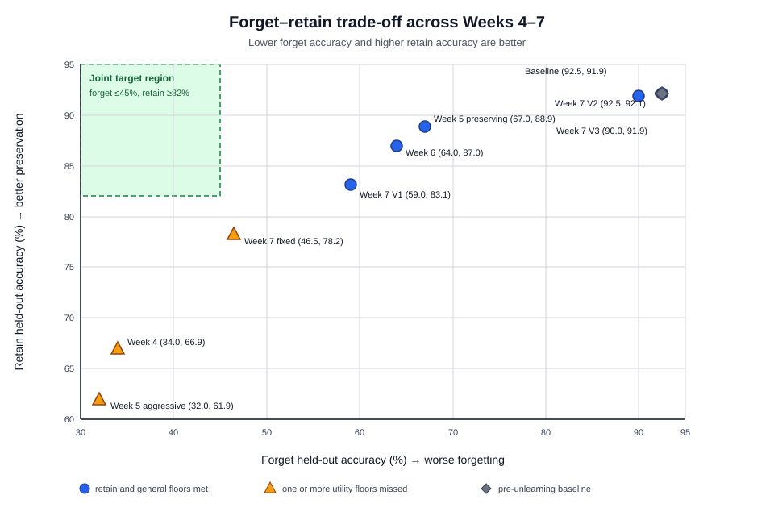

# Weeks 4–7 Thesis Synthesis: The Forgetting–Utility Trade-off

Generated from the authoritative GitHub `main` state at commit `cefcda9` on
2026-07-14. This report consolidates the final held-out results from the Week 4
through Week 7 experiment sequence. The machine-readable companion table is
[week4-week7-master-comparison.csv](week4-week7-master-comparison.csv).

## Research question

How far can targeted synthetic facts be suppressed in a Qwen2.5-0.5B-Instruct
LoRA adapter while preserving answers about retained synthetic facts and a
fixed general-control set?

The primary decision rule used by the later experiments was:

- forget held-out accuracy at or below **45%**;
- retain held-out accuracy at or above **82%**; and
- general-control accuracy at or above **50%**.

Lower forget accuracy indicates stronger behavioral forgetting. Higher retain
and general-control accuracy indicate better preservation. These are behavioral
evaluation measures; they do not by themselves prove that information has been
removed from model parameters.

## Consolidated results

| Stage | Method or role | Forget held-out ↓ | Retain held-out ↑ | General ↑ | All targets? |
| --- | --- | ---: | ---: | ---: | :---: |
| Week 3.5 | learned baseline before unlearning | 92.5% | 91.9% | 56.0% | n/a |
| Week 4 | gradient ascent | **34.0%** | 66.9% | 50.0% | No |
| Week 5 | preserving selected checkpoint | 67.0% | **88.9%** | 58.0% | No |
| Week 5 | aggressive contrast | **32.0%** | 61.9% | 46.0% | No |
| Week 6 | PCGrad-style constrained gradient | 64.0% | 87.0% | 54.0% | No |
| Week 7 V1 | adaptive constrained selected | 59.0% | 83.1% | 54.0% | No |
| Week 7 V1 | matched fixed-pressure control | 46.5% | 78.2% | 52.0% | No |
| Week 7 V2 | rollback-constrained selected | 92.5% | **92.1%** | 58.0% | No |
| Week 7 V3 | normalized-gradient rollback | 90.0% | 91.9% | **60.0%** | No |

Bold values mark a target-satisfying or otherwise notable boundary value; they
do not indicate that a row satisfies the full joint objective.

The upper-left target region requires both strong forgetting and retained
utility. None of the evaluated checkpoints enters it. Points that meet the
retain and general floors cluster farther right, where forget accuracy remains
high. Points with the strongest forgetting fall below the retain floor.

## Interpretation by phase

### Week 4 established that behavioral forgetting is achievable

Gradient ascent reduced forget held-out accuracy from 92.5% to 34.0%, passing
the forgetting target. Retain held-out accuracy simultaneously fell from 91.9%
to 66.9%. Week 4 therefore demonstrated strong suppression but not selective
suppression.

### Week 5 mapped the trade-off

The selected preserving checkpoint retained 88.9% accuracy and reached 58.0%
on general controls, but forget accuracy remained 67.0%. The aggressive
contrast reached the strongest observed forgetting, 32.0%, while retain fell
to 61.9% and general controls to 46.0%. These paired results show that checkpoint
selection changes where the model sits on the trade-off frontier; it does not
remove the frontier.

### Week 6 provided a modest constrained-optimization improvement

The PCGrad-style checkpoint improved forget accuracy by 3.0 percentage points
relative to the Week 5 preserving checkpoint, from 67.0% to 64.0%, while retain
remained 87.0% and general controls remained above their floor at 54.0%.
Projection was activated on 56% of the selected candidate's steps, showing that
forget and preservation gradients frequently conflicted. The method improved
the balance modestly but remained 19 points above the forget target.

### Week 7 V1 produced the best selected utility-constrained balance

Adaptive constraint control reached 59.0% forget, 83.1% retain, and 54.0%
general accuracy. Among the globally selected checkpoints that met both utility
floors, this was the strongest forgetting result. The matched fixed-pressure
control reached 46.5% forget but only 78.2% retain. Thus the adaptive controller
gained 4.9 retain points at the cost of 12.5 forget points; it enforced the
utility requirement but did not solve the joint target.

### Week 7 V2 and V3 are informative negative results

Rollback V2 preserved 92.1% retain accuracy but left forget accuracy unchanged
at 92.5%. Its independent trial-8 audit confirmed no hidden improvement.
Normalized-gradient rollback V3 reduced forget accuracy only to 90.0%, while
preserving 91.9% retain and improving general controls to 60.0%. These results
show that strict rollback, progress gates, and strong preservation pressure can
reject or neutralize the updates needed for meaningful forgetting.

## Main thesis finding

Across this controlled synthetic-fact setting, targeted behavioral suppression
and utility preservation form a persistent empirical trade-off. Aggressive
updates can satisfy the forgetting target, but they damage retained knowledge.
Preservation-aware methods substantially reduce that damage, but none of the
tested methods simultaneously achieves forget ≤45%, retain ≥82%, and general
≥50%. The strongest defensible conclusion is therefore not that selective
unlearning was solved, but that progressively stronger constraints revealed
where and why the trade-off becomes binding.

The recommended representative checkpoints are:

- **Week 4 gradient ascent** when demonstrating maximum forgetting;
- **Week 5 preserving** when demonstrating maximum utility with partial
  forgetting; and
- **Week 7 V1 adaptive** as the best selected compromise under the stated
  utility floors.

Week 7 V2 and V3 should remain in the thesis as negative results rather than be
presented as improvements.

## Limitations and threats to validity

- The experiments use one small base model and one synthetic-fact task, so the
  findings do not establish generality across architectures or natural data.
- The preserved artifacts do not establish multi-seed robustness. Differences
  of only a few percentage points should therefore be interpreted cautiously.
- Checkpoint selection and final evaluation are separated where supported, but
  not every control received an equally extensive full evaluation.
- The general-control set is a small task-specific guardrail rather than a
  comprehensive language-model capability benchmark.
- Accuracy-based suppression can reflect refusal, confusion, or changed answer
  formatting; it is not direct evidence of parameter-level erasure or resistance
  to extraction attacks.
- The experiments compare related but not identical optimization and selection
  procedures, so cross-week differences support an empirical progression more
  strongly than a clean causal attribution to one component.

## Recommended next work

The primary experiment series should now be frozen and converted into thesis
chapters. If compute and schedule permit one final empirical addition, it should
be a preregistered multi-seed replication of the Week 4, Week 5 preserving, and
Week 7 V1 representative checkpoints under the same evaluation protocol—not a
new broad hyperparameter sweep.

The writing sequence should be:

1. Methods: dataset, strict scorer, forget/retain splits, general controls, and
   checkpoint-selection protocol.
2. Results: the consolidated table and trade-off figure in this report.
3. Discussion: gradient conflict, the utility cost of strong forgetting, and
   the V2/V3 negative results.
4. Limitations: scope, seed robustness, behavioral evaluation, and the meaning
   of “unlearning.”

## Evidence provenance

- [Week 4 metrics](../Week%204/results/gradient_ascent_unlearning_v1/results/metrics.json)
- [Week 5 comparison report](../Week%205/comparison_report/report_outputs/week5_comparison_report.md)
- [Week 5 aggressive contrast](../Week%205/results/aggressive_contrast_evaluation_v1/c09_most_aggressive_epoch_03/results/aggressive_contrast_report.md)
- [Week 6 conclusions](../Week%206/CONCLUSIONS.md)
- [Week 6 generated report](../Week%206/results/constrained_gradient_unlearning_v1/results/week6_constrained_gradient_report.md)
- [Week 7 V1 generated report](../Week%207/results/adaptive_constrained_unlearning_v1/results/week7_adaptive_constraint_report.md)
- [Week 7 V2 trial-8 audit](../Week%207/results/rollback_constrained_unlearning_v2_trial8_audit/results/trial8_audit_report.md)
- [Week 7 V3 generated report](../Week%207/results/normalized_rollback_unlearning_v3/results/week7_v3_normalized_report.md)
- [Authoritative cross-week metrics](../Week%207/results/normalized_rollback_unlearning_v3/results/week7_v3_cross_week_comparison.csv)
